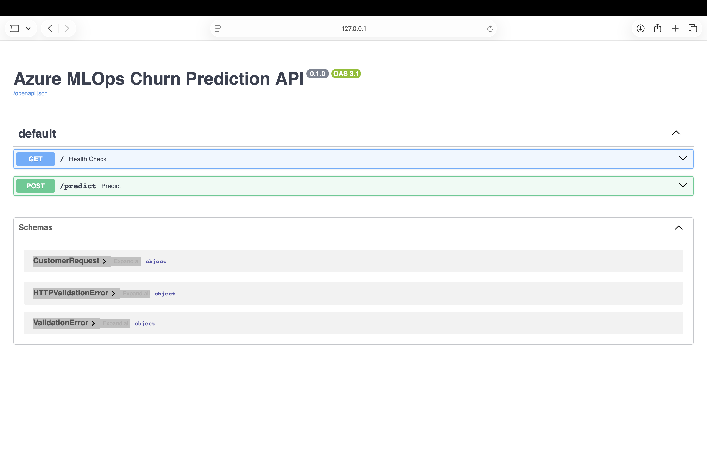
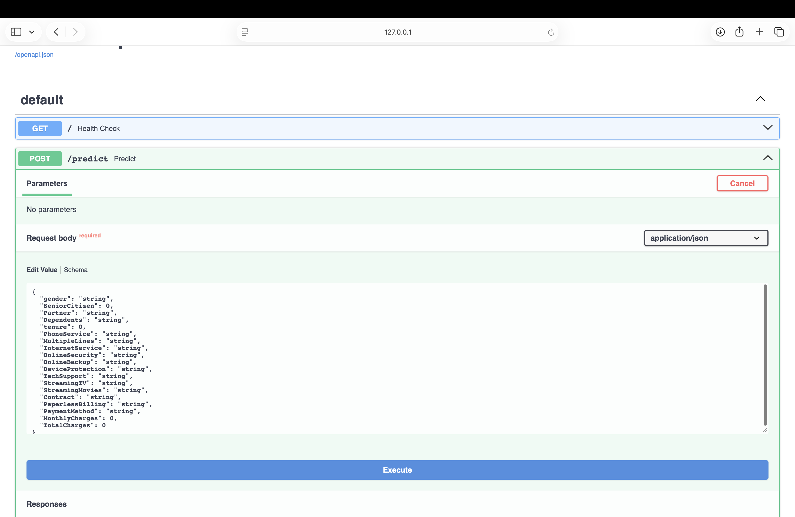
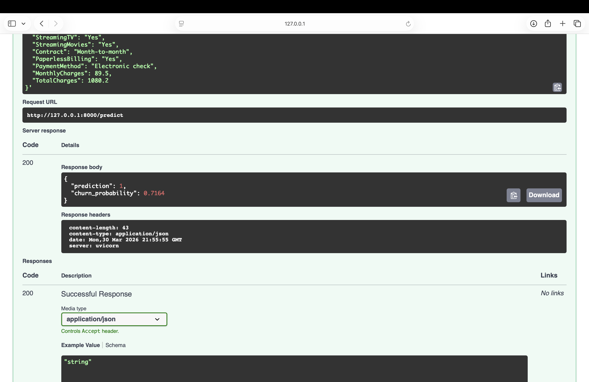

# 🚀 Azure MLOps Churn Prediction Pipeline

> **Production-grade end-to-end MLOps system** — Train → Track → Monitor → Deploy → Auto-Scale

[](https://github.com/DeekshithaLakshmiKalavala/azure-mlops-churn-prediction/actions)
[](http://churn-api-15.eastus.azurecontainer.io:8000/docs)
[](https://python.org)
[](https://mlflow.org)
[](https://evidentlyai.com)

## 🌐 Live Demo
**API Docs:** http://churn-api-15.eastus.azurecontainer.io:8000/docs

Try a live prediction — no setup needed!

---

## 📸 Screenshots

### API Documentation


### Making a Prediction  


### Live Prediction Result


## 🏗️ Architecture

```
┌─────────────────────────────────────────────────────────────────┐
│                        Developer Pushes Code                     │
└─────────────────────────┬───────────────────────────────────────┘
                          │
                          ▼
┌─────────────────────────────────────────────────────────────────┐
│                   GitHub Actions CI/CD Pipeline                  │
│                                                                  │
│  ┌──────────┐   ┌──────────┐   ┌──────────┐   ┌────────────┐  │
│  │ 🧪 Test  │──▶│🤖 Train  │──▶│📊 Drift  │──▶│🐳 Docker  │  │
│  │  pytest  │   │  MLflow  │   │ Evidently│   │  Build +  │  │
│  │  2 tests │   │ 3 models │   │ 68 tests │   │  Push ACR │  │
│  └──────────┘   └──────────┘   └──────────┘   └─────┬──────┘  │
│                                                       │         │
│                                               ┌───────▼──────┐  │
│                                               │ 🚀 Deploy ACI│  │
│                                               │   Azure      │  │
│                                               └──────────────┘  │
└─────────────────────────────────────────────────────────────────┘
                          │
                          ▼
┌─────────────────────────────────────────────────────────────────┐
│                    Azure Infrastructure                          │
│                                                                  │
│   ┌─────────────────┐         ┌──────────────────────────────┐  │
│   │  Azure Container│         │   Azure Container Instance   │  │
│   │    Registry     │────────▶│                              │  │
│   │  (Docker Image) │         │   FastAPI + Uvicorn          │  │
│   └─────────────────┘         │   /predict endpoint          │  │
│                                │   /health endpoint           │  │
│                                │   /docs  (Swagger UI)        │  │
│                                └──────────────────────────────┘  │
└─────────────────────────────────────────────────────────────────┘
```

---

## ✨ Features

| Feature | Technology | What It Does |
|---|---|---|
| **Model Training** | Scikit-learn, XGBoost | Trains 3 candidate models, picks best by ROC-AUC |
| **Experiment Tracking** | MLflow | Logs params, metrics, artifacts — full model versioning |
| **Drift Monitoring** | Evidently AI | Detects data drift, blocks deploy if data shifts |
| **REST API** | FastAPI | `/predict` endpoint returns churn probability in real-time |
| **Containerization** | Docker | Reproducible builds, pushed to Azure Container Registry |
| **CI/CD Pipeline** | GitHub Actions | 5-stage automated pipeline on every push |
| **Cloud Deployment** | Azure ACI | Live public API, auto-restarted on failure |
| **Auto-Scaling** | Kubernetes (AKS) | Scales 2→10 pods based on CPU load |

---

## 🛠️ Tech Stack

```
Language    : Python 3.11
ML          : Scikit-learn, XGBoost, Pandas, NumPy
Tracking    : MLflow 2.15.1
Monitoring  : Evidently AI 0.4.40
API         : FastAPI + Uvicorn + Gunicorn
Container   : Docker
Registry    : Azure Container Registry (ACR)
Deployment  : Azure Container Instances (ACI)
Orchestration: Kubernetes (AKS) manifests included
CI/CD       : GitHub Actions (5-stage pipeline)
```

---

## 📁 Project Structure

```
azure-mlops-churn-prediction/
├── app/
│   └── main.py              # FastAPI app with /predict endpoint
├── src/
│   ├── train.py             # MLflow training — 3 models, auto-registers best
│   ├── monitor.py           # Evidently drift monitoring — PASS/FAIL
│   ├── simulate_drift.py    # Generate synthetic drifted data for testing
│   └── model_loader.py      # Loads model from MLflow registry or local
├── tests/
│   ├── conftest.py          # Pytest fixtures
│   └── test_api.py          # API unit tests
├── deployment/
│   ├── k8s/
│   │   ├── deployment.yaml  # K8s Deployment + HPA (auto-scaling)
│   │   └── namespace.yaml   # K8s namespace + resource quotas
│   └── aks_deploy.sh        # One-command AKS deployment script
├── models/
│   ├── churn_model.joblib   # Trained model
│   ├── scaler.pkl           # Feature scaler
│   └── features.txt         # Feature names
├── data/
│   └── churn.csv            # Telco churn dataset
├── .github/
│   └── workflows/
│       └── ci.yml           # 5-stage GitHub Actions pipeline
├── Dockerfile               # Multi-stage Docker build
└── requirements.txt         # Pinned dependencies
```

---

## 🚀 Quick Start

### Run Locally

```bash
# 1. Clone the repo
git clone https://github.com/DeekshithaLakshmiKalavala/azure-mlops-churn-prediction.git
cd azure-mlops-churn-prediction

# 2. Create virtual environment
python -m venv venv
source venv/bin/activate

# 3. Install dependencies
pip install -r requirements.txt

# 4. Train model (logs to MLflow)
python src/train.py

# 5. View MLflow experiments
mlflow ui
# Open http://localhost:5000

# 6. Start the API
uvicorn app.main:app --reload
# Open http://localhost:8000/docs
```

### Run Drift Monitor

```bash
# Simulate drifted production data
python src/simulate_drift.py --drift medium

# Run drift check (exit code 1 if drift detected)
python src/monitor.py --ref data/churn.csv --cur data/current.csv

# Open the HTML drift report
open reports/drift_report_*.html
```

### Run with Docker

```bash
docker build -t churn-api .
docker run -p 8000:8000 churn-api
# Open http://localhost:8000/docs
```

---

## 🧪 Sample API Request

**POST** `http://churn-api-15.eastus.azurecontainer.io:8000/predict`

```json
{
  "gender": "Female",
  "SeniorCitizen": 0,
  "Partner": "Yes",
  "Dependents": "No",
  "tenure": 12,
  "PhoneService": "Yes",
  "MultipleLines": "No",
  "InternetService": "Fiber optic",
  "OnlineSecurity": "No",
  "OnlineBackup": "Yes",
  "DeviceProtection": "No",
  "TechSupport": "No",
  "StreamingTV": "Yes",
  "StreamingMovies": "Yes",
  "Contract": "Month-to-month",
  "PaperlessBilling": "Yes",
  "PaymentMethod": "Electronic check",
  "MonthlyCharges": 89.5,
  "TotalCharges": 1080.2
}
```

**Response:**
```json
{
  "prediction": 1,
  "churn_probability": 0.8636
}
```

---

## 📊 MLflow Experiment Results

| Model | Accuracy | F1 Score | ROC-AUC |
|---|---|---|---|
| Logistic Regression | 0.81 | 0.78 | 0.85 |
| Random Forest (100) | 0.83 | 0.80 | 0.87 |
| **Random Forest (200)** | **0.84** | **0.82** | **0.89** |

✅ Best model auto-registered in MLflow Model Registry

---

## 🔄 CI/CD Pipeline

Every push to `main` triggers:

```
1. 🧪 Test          — pytest runs 2 API tests
2. 🤖 Train         — MLflow trains & registers 3 models
3. 📊 Drift Check   — Evidently runs 68 drift tests (blocks deploy if failed)
4. 🐳 Build & Push  — Docker image pushed to Azure ACR
5. 🚀 Deploy        — Container deployed to Azure ACI
```

---

## ☁️ Azure Setup

```bash
# Create resource group
az group create --name churn-mlops-rg --location eastus

# Create container registry
az acr create --resource-group churn-mlops-rg --name churnmlopsacr --sku Basic --admin-enabled true

# Deploy to AKS
chmod +x deployment/aks_deploy.sh
./deployment/aks_deploy.sh
```

---

## 👩‍💻 Author

**Deekshitha Lakshmi Kalavala**
- GitHub: [@DeekshithaLakshmiKalavala](https://github.com/DeekshithaLakshmiKalavala)
- Live API: http://churn-api-15.eastus.azurecontainer.io:8000/docs